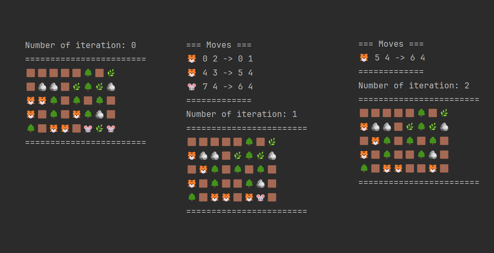

# food-chain-simulation

This project simulates a 2D world with a food chain, featuring herbivores, predators, grass, rocks, trees and dirt. Creatures move, interact, and survive in an ecosystem where predators hunt herbivores and both depend on the availability of grass.

## Features
- **Dynamic Ecosystem:** Herbivores eat grass, predators hunt herbivores, and static objects like rocks and trees add complexity to the environment.
- **Turn-Based Simulation:** Each turn, creatures make decisions based on their characteristics and the state of the world.
- **Action Management:** Actions are executed in phases, such as initialization actions before the simulation starts and turn actions for each round of simulation.

## Screenshots
